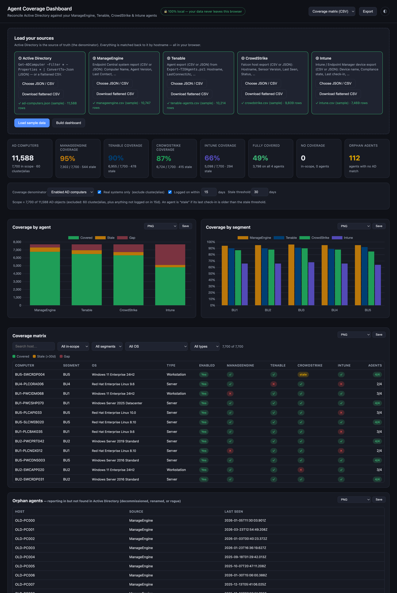

# Agent Coverage Dashboard

A **100% browser-local** dashboard that reconciles your **Active Directory** computer inventory against your **ManageEngine Endpoint Central**, **Tenable**, and **CrowdStrike** agents — so you can see, per machine, which security/management agents are actually installed, which are stale, and where the gaps are. **The data never leaves your browser.** No server, no upload, no SaaS.

**Live:** https://cloudanimal.github.io/agent-coverage-dashboard/



## Why

Agent coverage is the quiet failure mode of every security program: a vuln scanner, a patch agent, and an EDR sensor are only as good as the percentage of machines they're actually on. The authoritative list of machines is Active Directory — everything else should reconcile back to it. This page does that reconciliation in the browser, so you can run it against sensitive asset exports without sending them anywhere.

## The inputs

| # | Source | How to produce it | Key columns used |
|---|---|---|---|
| ① | **Active Directory** | `Get-ADComputer -Filter * -Properties * \| ConvertTo-Json` (JSON), or a flattened CSV | `Name`, `DNSHostName`, `Enabled`, `OperatingSystem`, `DistinguishedName` (OU → segment/type), `LastLogonDate`, `ServicePrincipalName` |
| ② | **ManageEngine** | Endpoint Central system report (CSV/JSON) | Computer Name, Agent Version, Last Contact Time, Last Successful Scan Time, Last Patch Date, Custom Group |
| ③ | **Tenable** | Agent export from [`Export-TIOAgents.ps1`](https://github.com/cloudanimal/NessusAgent/blob/main/Public/Export-TIOAgents.ps1) (CSV/JSON) | Hostname, AgentId, Groups, LastConnectUtc, LastScannedUtc |
| ④ | **CrowdStrike** | Falcon host export (CSV/JSON) | Hostname, Sensor Version, Last Seen, Status / RFM, OS Version, Platform |

> **Microsoft Intune** support is temporarily removed. Because Intune (MDM) inventories mobile/personal devices that don't live in Active Directory, reconciling it against an AD denominator understates coverage — it needs a different inventory model (AD ∪ Intune) and will be reintroduced.

Active Directory is the **source of truth** (the denominator). The agent sources are matched back to it. Every source accepts **CSV or JSON** and offers a **"download flattened CSV"** button.

### Filtering to real, active systems

Two AD-aware scope filters (both on by default) keep coverage honest:
- **Real systems only** — excludes cluster name objects, virtual computer objects, and aliases (anything with no `OperatingSystem` or a cluster `ServicePrincipalName` such as `MSServerClusterMgmtAPI/…`).
- **Logged on within N days** (default 15) — narrows to recently-active machines, so decommissioned-but-not-deleted objects don't drag the denominator.

### Hostname matching

Every source is matched on a **normalized hostname** — the short name (everything before the first dot), upper-cased — so a Tenable agent reporting `host.corp.local` matches the AD `Name` `HOST`. Anything that doesn't match surfaces as an **orphan** (an agent reporting in with no AD computer — decommissioned, renamed, or rogue).

### Active Directory JSON → flattened CSV

`Get-ADComputer -Properties *` produces deeply nested JSON (nested objects, arrays, PowerShell `/Date(…)/` timestamps). The page **flattens it in-browser** — nested objects become `parent.child` columns, arrays are joined, dates normalized to ISO — and you can **download the fully-flattened CSV** for use elsewhere.

## What it reports

- **Coverage KPIs** — per-agent coverage % vs AD, fully-covered %, machines with no coverage, stale agents, orphan agents.
- **Coverage by agent** — covered vs stale vs gap, per agent.
- **Coverage by segment** — coverage % per agent across AD OUs / business units.
- **Coverage matrix** — every in-scope computer with a ✓ / stale / ✗ per agent, filterable by segment, OS, type, and coverage state (gaps, no coverage, fully covered, stale), searchable and sortable.
- **Orphan agents** — agents with no matching AD computer.
- Configurable **stale threshold** and a denominator toggle (enabled-only vs all AD computers).

## Exports

Coverage matrix (CSV), coverage gaps (CSV), orphan agents (CSV), the flattened AD inventory (CSV), and a full multi-sheet report (XLSX: Summary, Coverage Matrix, Gaps, Orphans). Each chart/table also saves as PNG.

## Try it

Click **Load sample data** — a fully synthetic dataset (11,528 AD computers across 5 segments + 60 cluster/alias objects, plus matching ManageEngine / Tenable / CrowdStrike exports with realistic gaps, stale agents, and orphans). It uses the **same systems as the [Tenable VM dashboard](https://github.com/cloudanimal/tenable-vm-dashboard)** so the two line up. It is **not** based on any real organization.

## Run locally

```bash
git clone https://github.com/cloudanimal/agent-coverage-dashboard
cd agent-coverage-dashboard
python3 -m http.server 8000   # serve so "Load sample data" can fetch the bundled files
# open http://localhost:8000
```

Uploading your own files works even from `file://`; only the bundled **Load sample data** button needs the page served over HTTP.

## Tech

Static `index.html` + `app.js`, no build step. [PapaParse](https://www.papaparse.com) (CSV), [SheetJS](https://sheetjs.com) (XLSX), [Chart.js](https://www.chartjs.org) (charts), and [html2canvas](https://html2canvas.hertzen.com) (PNG export) are **vendored in `vendor/`**, so there's no external CDN dependency and the page works offline / air-gapped.

`gen-sample.js` (Node) regenerates the synthetic sample dataset.

## Note

All sample data is entirely synthetic. Hostname matching is only as good as the names your tools report; review the orphans list and the no-coverage gaps before treating the numbers as ground truth.

## License

MIT
